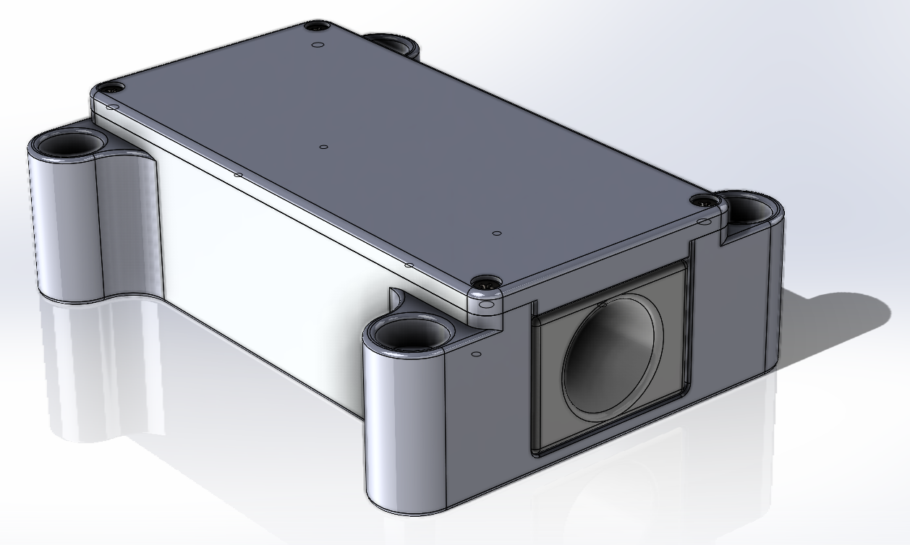
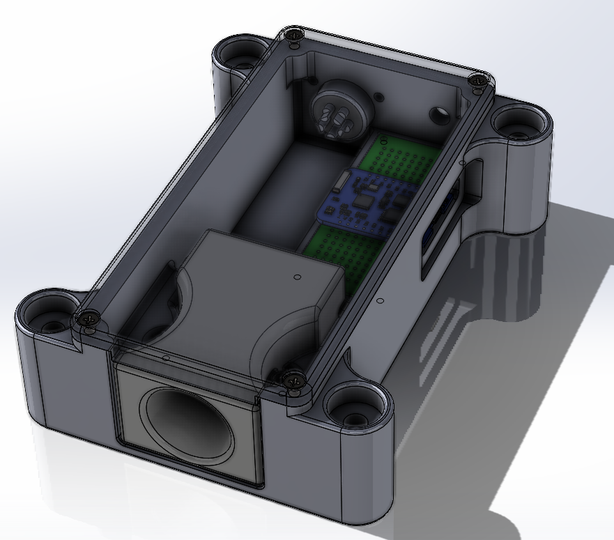
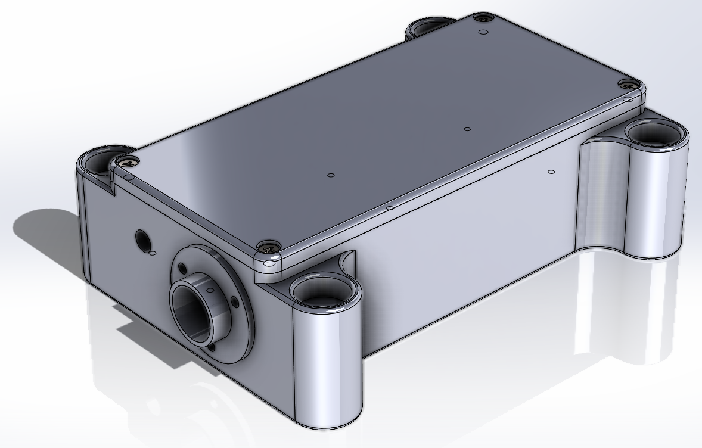

- [Introduction](#introduction)
  - [System Concept / Architecture](#system-concept--architecture)
  - [Mechanical Design](#mechanical-design)
- [Software Design](#software-design)
  - [Tasmota Extension](#tasmota-extension)

# Introduction

## System Concept / Architecture

## Mechanical Design

# Software Design
## Tasmota Extension
https://github.com/arendst/Tasmota/pull/17376